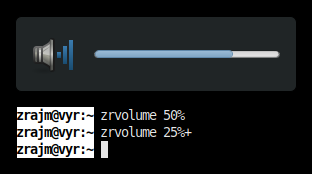

# zrvolume

Desktop volume change script (change volume &amp; display notification with
current volume).

This is a lightweight script for changing and displaying the volume on your
desktop. It uses the standard desktop notifications to display the volume, and
if you invoke the script repeatedly it will replace the notification with the
new value.

This script is as lightweight as possible. It uses a plain `sh` shell to load
quickly. It also uses `gdbus` command (which I *believe* comes preinstalled on
normal Ubuntu/Debian desktop system) rather than the otherwise common
`notify-send` (which has to be installed manually).

Usage
-----
The script is meant to be invoked from the keybindings of your window manager.
I use the following in my Openbox config `~/.config/openbox/lubuntu-rc.xml`:

    <!-- Keybinding for Volume management -->
    <keybind key="XF86AudioRaiseVolume">
      <action name="Execute">
        <command>~/bin/zrvolume 5%+</command>
      </action>
    </keybind>
    <keybind key="XF86AudioLowerVolume">
      <action name="Execute">
        <command>~/bin/zrvolume 5%-</command>
      </action>
    </keybind>
    <keybind key="XF86AudioMute">
      <action name="Execute">
        <command>~/bin/zrvolume toggle</command>
      </action>
    </keybind>

<!--[eof]-->
